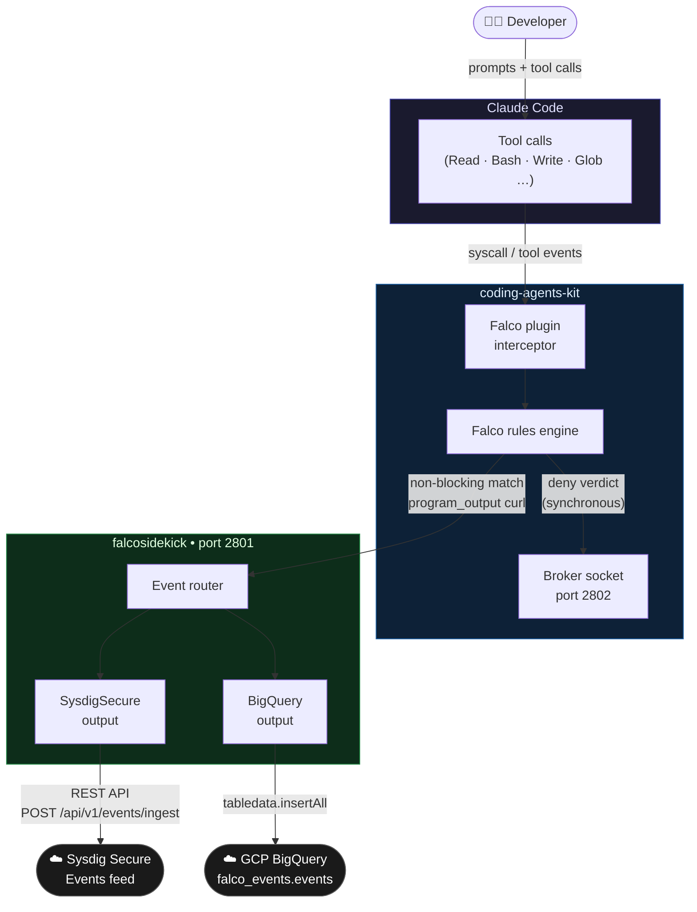

# coding-agents-kit + falcosidekick Integration Guide

This guide walks through setting up a local falcosidekick instance built from the forked
repository and connecting it to a running coding-agents-kit installation so that Falco events
are forwarded to both a Sysdig Secure environment and a BigQuery table.

## Architecture overview



> **Key behaviour**: deny-rule verdicts are delivered synchronously on port 2802 and close
> the event cycle before `program_output` fires — only non-blocking rules (NOTICE / INFO /
> DEBUG priority) reliably reach falcosidekick and are forwarded downstream.

## Table of contents

- [Prerequisites](#prerequisites)
- [Step 1 — Clone and build falcosidekick](#step-1--clone-and-build-falcosidekick)
- [Step 2 — Obtain BigQuery credentials](#step-2--obtain-bigquery-credentials)
  - [Option A: Use the Threat Research Team table](#option-a-use-the-threat-research-team-table)
  - [Option B: Create your own table](#option-b-create-your-own-table)
  - [Option C: Use the secops-326013 shared table (Sysdig engineers only)](#option-c-use-the-secops-326013-shared-table-sysdig-engineers-only)
- [Step 3 — Obtain Sysdig Secure credentials](#step-3--obtain-sysdig-secure-credentials)
- [Step 4 — Create falcosidekick config.yaml](#step-4--create-falcosidekick-configyaml)
- [Step 5 — Start falcosidekick](#step-5--start-falcosidekick)
- [Step 6 — Connect coding-agents-kit to falcosidekick](#step-6--connect-coding-agents-kit-to-falcosidekick)
- [Step 7 — Verify the full pipeline](#step-7--verify-the-full-pipeline)
- [Troubleshooting](#troubleshooting)

---

## Prerequisites

| Requirement | Notes |
|-------------|-------|
| **Go 1.22+** | Install via `brew install go` (macOS) or see [golang.org/dl](https://golang.org/dl) |
| **Git** | Standard system install |
| **coding-agents-kit** | Must already be installed and running (`falco`, broker socket active) |
| **gcloud CLI** | Required for BigQuery authentication — see [Installing the bq CLI](outputs/bigquery.md#installing-the-bq-cli) |
| **GitHub access** | To clone the fork |

Verify Go is available before continuing:

```bash
go version   # must print go1.22 or later
```

---

## Step 1 — Clone and build falcosidekick

Clone the fork that contains the SysdigSecure and BigQuery outputs:

```bash
git clone https://github.com/aitoracedo/falcosidekick.git
cd falcosidekick
```

Build the binary for your local OS:

```bash
make falcosidekick
```

The binary is produced at `./falcosidekick` in the repository root. Verify it starts:

```bash
./falcosidekick --version
```

---

## Step 2 — Obtain BigQuery credentials

Choose one of the three options below. All options produce the same two artifacts you will
need for the config file:
- A **service account JSON key file** (path on your machine)
- The **project ID**, **dataset ID**, and **table ID**

### Option A: Use the Threat Research Team table

Contact the Threat Research Team to obtain:

| Item | What to ask for |
|------|-----------------|
| GCP project ID | The project that owns the BigQuery dataset |
| Dataset ID | The dataset name inside that project |
| Table ID | The table name inside that dataset |
| Service account key | A JSON key file for a service account with `roles/bigquery.dataEditor` on the dataset |

Save the key file to a secure path (e.g. `~/.config/falcosidekick-bq-key.json`) and set
permissions so only your user can read it:

```bash
chmod 600 ~/.config/falcosidekick-bq-key.json
```

The table must have the following schema. Ask the Threat Research Team to confirm it matches
or provision it themselves:

```json
[
  {"name": "timestamp",     "type": "TIMESTAMP", "mode": "NULLABLE"},
  {"name": "rule",          "type": "STRING",    "mode": "NULLABLE"},
  {"name": "priority",      "type": "STRING",    "mode": "NULLABLE"},
  {"name": "output",        "type": "STRING",    "mode": "NULLABLE"},
  {"name": "output_fields", "type": "STRING",    "mode": "NULLABLE"},
  {"name": "source",        "type": "STRING",    "mode": "NULLABLE"},
  {"name": "tags",          "type": "STRING",    "mode": "NULLABLE"}
]
```

### Option B: Create your own table

Run the self-contained provisioning script from the BigQuery output documentation. It creates
the service account, dataset, table, IAM grant, and key file in one step.

```bash
# Download the script
curl -fsSL https://raw.githubusercontent.com/aitoracedo/falcosidekick/master/docs/outputs/bigquery.md \
  | sed -n '/```bash/,/```/p' | head -80 > setup-bigquery.sh
```

Or copy the script directly from [`docs/outputs/bigquery.md`](outputs/bigquery.md#replicating-the-test-environment),
edit the `PROJECT_ID`, `DATASET`, and `TABLE` variables at the top, then run:

```bash
chmod +x setup-bigquery.sh
./setup-bigquery.sh
```

The script prints the exact config block to add to `config.yaml` when it finishes.

### Option C: Use the secops-326013 shared table (Sysdig engineers only)

Sysdig engineers can write to the shared `falco_events.events` table in GCP project
`secops-326013`. Request a service account key from the project owner, or use your own
`gcloud` credentials if your account has `roles/bigquery.dataEditor` on the dataset.

```
Project ID : secops-326013
Dataset ID : falco_events
Table ID   : events
```

---

## Step 3 — Obtain Sysdig Secure credentials

You need an API token or an agent access key from your Sysdig Secure environment.

**Get the API token:**

1. Log in to your Sysdig Secure instance
2. Go to **Settings → User Profile → API Token**
3. Copy the token

**Get the Sysdig Secure URL:**

This is the base URL of your environment, e.g. `https://secure.sysdig.com` or
`https://eu1.app.sysdig.com`. Do not include a trailing slash.

> [!NOTE]
> If you are using the Prodmon internal environment (`prodmon.app.sysdig.com`), events sent
> via the REST path return HTTP 200 but are silently dropped due to token permission
> constraints on that specific environment. The pipeline still works end-to-end for BigQuery.
> For events to appear in the Sysdig Secure feed, use a real customer environment or a
> Sysdig environment where the API token has ingestion permissions.

---

## Step 4 — Create falcosidekick config.yaml

Create `config.yaml` in the falcosidekick repository root. This file is gitignored by
default — do not commit it as it contains credentials.

```yaml
sysdigsecure:
  url: "https://YOUR_SYSDIG_URL"           # e.g. https://secure.sysdig.com
  apitoken: "YOUR_SYSDIG_API_TOKEN"
  minimumpriority: "debug"
  checkcert: true

bigquery:
  projectid: "YOUR_GCP_PROJECT_ID"
  datasetid: "YOUR_DATASET_ID"
  tableid: "YOUR_TABLE_ID"
  servicecredentials: "/path/to/your/sa-key.json"
  minimumpriority: "debug"
```

Replace every placeholder with the values from steps 2 and 3. Optionally add
`customlabels` to tag every row with metadata identifying your machine or team:

```yaml
bigquery:
  # ... other fields ...
  customlabels:
    engineer: "your-name"
    environment: "local"
```

> [!NOTE]
> `servicecredentials` must be an absolute path — the `~` shorthand is not expanded.
> Use `$HOME` expansion or the full path (e.g. `/Users/yourname/falcosidekick-bq-key.json`).

---

## Step 5 — Start falcosidekick

```bash
cd /path/to/falcosidekick
./falcosidekick -c config.yaml
```

On startup the log should confirm both outputs are enabled:

```
Enabled Outputs: [...BigQuery... SysdigSecure...]
```

Falcosidekick listens on port **2801** by default. Verify it is healthy:

```bash
curl http://localhost:2801/ping   # should respond: pong
```

Keep this terminal open (or run the process in the background with `nohup` / a process manager).

---

## Step 6 — Connect coding-agents-kit to falcosidekick

coding-agents-kit ships a ready-made Falco config fragment that wires `program_output` to
falcosidekick. Enable it by adding it to `falco.yaml`.

**Edit `~/.coding-agents-kit/config/falco.yaml`** and add the falcosidekick fragment as
the **last entry** in `config_files` (it must come after `falco.sysdig_forwarder.yaml` to
override the `program_output` setting):

```yaml
config_files:
  - ${HOME}/.coding-agents-kit/config/falco.coding_agents_plugin.yaml
  - ${HOME}/.coding-agents-kit/config/falco.sysdig_forwarder.yaml
  - ${HOME}/.coding-agents-kit/config/falco.falcosidekick.yaml   # add this line
```

Because `watch_config_files: true` is set in `falco.yaml`, Falco detects the change and
restarts automatically within a few seconds. You will see a brief reconnection in the
coding-agents-kit logs. No manual restart is required.

Verify the fragment is active by tailing the Falco log or checking that falcosidekick
receives events within a few seconds of your next Claude Code tool call.

---

## Step 7 — Verify the full pipeline

**Send a synthetic test event:**

```bash
curl -s -X POST http://localhost:2801/ \
  -H "Content-Type: application/json" \
  -d '{
    "rule": "Test rule",
    "priority": "Warning",
    "output": "pipeline verification event",
    "output_fields": {"engineer": "your-name"},
    "source": "coding_agent",
    "tags": ["test"],
    "time": "'$(date -u +%Y-%m-%dT%H:%M:%SZ)'"
  }'
```

**Check BigQuery (bq CLI):**

```bash
bq query --project_id=YOUR_GCP_PROJECT_ID --nouse_legacy_sql \
  'SELECT timestamp, rule, priority, source, tags
   FROM YOUR_DATASET_ID.YOUR_TABLE_ID
   ORDER BY timestamp DESC
   LIMIT 10'
```

**Check BigQuery (REST API, no bq CLI needed):**

```bash
curl -s -X POST \
  "https://bigquery.googleapis.com/bigquery/v2/projects/YOUR_GCP_PROJECT_ID/queries" \
  -H "Authorization: Bearer $(gcloud auth print-access-token)" \
  -H "Content-Type: application/json" \
  -d '{
    "query": "SELECT timestamp, rule, priority, source, tags FROM YOUR_DATASET_ID.YOUR_TABLE_ID ORDER BY timestamp DESC LIMIT 10",
    "useLegacySql": false
  }' | jq '[.rows[]? | {timestamp: .f[0].v, rule: .f[1].v, priority: .f[2].v, source: .f[3].v, tags: .f[4].v}]'
```

The row should appear within a few seconds of sending. Once confirmed, trigger a real
Falco event by performing any tool call that matches an active rule (e.g. reading a file
outside the working directory) and repeat the query — the live event should appear with
`source: coding_agent` and the matching rule name.

---

## Troubleshooting

| Symptom | Likely cause | Fix |
|---------|-------------|-----|
| `Enabled Outputs` does not list `BigQuery` | `projectid`, `datasetid`, or `tableid` is empty, or `servicecredentials` path is wrong | Check config.yaml and verify the key file path is absolute and exists |
| `BigQuery credentials` error on startup | Key file not found or not valid JSON | Confirm the file exists, is readable (`chmod 600`), and is a valid service account JSON key |
| BigQuery rows are not appearing | Streaming inserts have a short delay | Wait 10–15 seconds and re-query; if still missing check falcosidekick logs for error lines |
| `SysdigSecure` shows `error` in logs | Wrong API token or URL | Verify the token and URL in config.yaml match your Sysdig environment |
| Falco events not reaching falcosidekick | falcosidekick fragment not loaded | Confirm `falco.falcosidekick.yaml` is the last entry in `config_files` in `falco.yaml` |
| `pong` not returned on port 2801 | falcosidekick not running | Start it with `./falcosidekick -c config.yaml` |
| Port 2801 already in use | Previous falcosidekick process still running | Run `pkill -f falcosidekick` then restart |
| Deny rule events not in BigQuery | Expected behaviour | Deny verdicts are delivered synchronously via port 2802; only non-blocking rules propagate via `program_output` to falcosidekick. See the [integration test results](outputs/bigquery.md#integration-test-results) for details |
